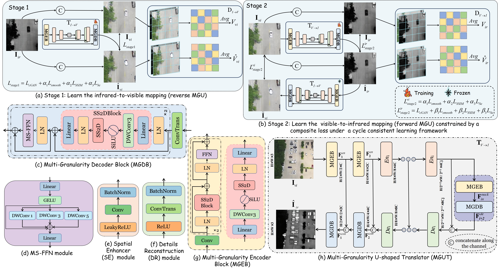

# CycleMamba
Official PyTorch implementation of the paper 
[CycleMamba: Cycle-Consistent Learning for Aerial Visible-to-Infrared Image Translation](https://ieeexplore.ieee.org/abstract/document/11359759)
**IEEE Transactions on Geoscience and Remote Sensing (TGRS)**, 2026.


- Authors:Chenhong Sui*, Zhichao Xu, Yu Meng, Danfeng Hong, Haipeng Wang, Bing Zhang, Gemine Vivone,

## 🌱Abstract
>The rapid advancement of deep neural networks (DNNs) has substantially progressed 
> image-to-image translation, yielding numerous sophisticated methods. However, most
> existing methods face not only the inherent pixel-level spatial misalignment 
> resulting from divergent imaging perspectives, but also the local geometric 
> distortion and structural incoherence stemming from inadequate cross-modal feature 
> alignment. To address this issue, we propose CycleMamba, a cycle-consistent 
> learning-based aerial visible-to-infrared image translation framework, which 
> enforces geometric constraints and semantic space alignment through globally-aware 
> bidirectional transformation, thereby alleviating pixel-level misalignment and 
> structural distortion. Specifically, inspired by the selective structured state-space 
> model (Mamba), a bidirectional cross-modal translation network based on 
> Multi-Granularity U-shaped Translators (MGUTs) is constructed, which integrates 
> Mamba's long-range modeling with CNN's local feature extraction strengths. Regarding 
> the stability of cyclic consistency learning, a dual-stage progressive training 
> mechanism is developed for visible-infrared-visible translation. Additionally, to 
> enhance the alignment of cross-modal features and structural preservation, the cycle 
> consistency constraints that collaborate with structural similarity and semantic 
> consistency losses are given to reduce spatial and semantic misalignment, facilitating
> fidelity. Comparative experiments with state-of-the-art methods are conducted on 
> three public datasets. Experimental results demonstrate that CycleMamba achieves 
> superior translation performance. Extensive ablation studies further evaluate the 
> effectiveness of the proposed method.

## Approach overview

<div align=center>

</div>

## Install
```
git clone https://github.com/xzhichaox/CycleMamba.git

```
## Getting Started
```
python==3.10.14
pytorch==2.1.1
torchvision==0.15.2 
numpy==1.26.4
causal_conv1d==1.1.0
mamba_ssm==1.1.0
```
As for the installation of mamba_ssm, please refer to [VMamba](https://github.com/MzeroMiko/VMamba)

## 🧩 Usage
### Train

- Step I. Ensure that the dataset consists of paired visible and infrared images.
- Step II. Change the `--dataroot` to your data path.
- Step III. Run the train_backward.sh.
```
bash train_backward.sh
```
- Step IV. Change the `--pretrain_path` to your pretrained checkpoint path, and then run train_forward.sh.

### Test

```
bash test_cyclemamba.sh
```
## Acknowledgement
Our work is built upon [Pix2pix](https://github.com/junyanz/pytorch-CycleGAN-and-pix2pix) and [VMamba](https://github.com/MzeroMiko/VMamba). 
Thanks to the author for sharing this awesome work!

### 🥰 Citation
If you find our work helpful in your research, please consider citing it!
```
@article{sui2026cyclemamba,
  title={CycleMamba: Cycle-Consistent Learning for Aerial Visible-to-Infrared Image Translation},
  author={Sui, Chenhong and Xu, Zhichao and Meng, Yu and Wang, Haipeng and Zhang, Bing and Vivone, Gemine},
  journal={IEEE Transactions on Geoscience and Remote Sensing},
  year={2026},
  publisher={IEEE}
}
```

